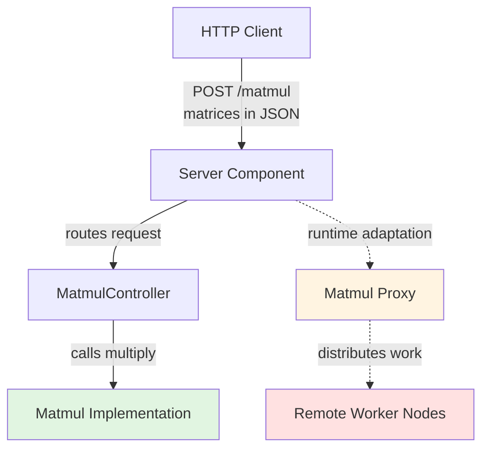
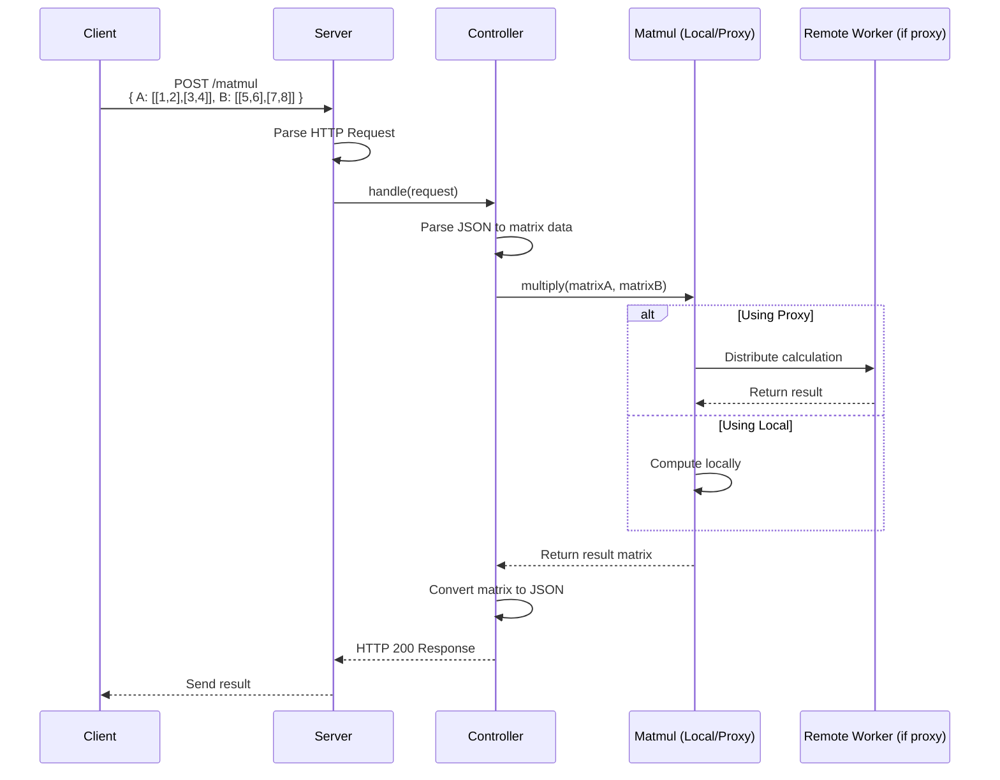
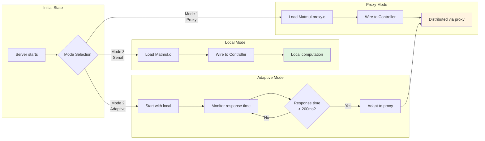
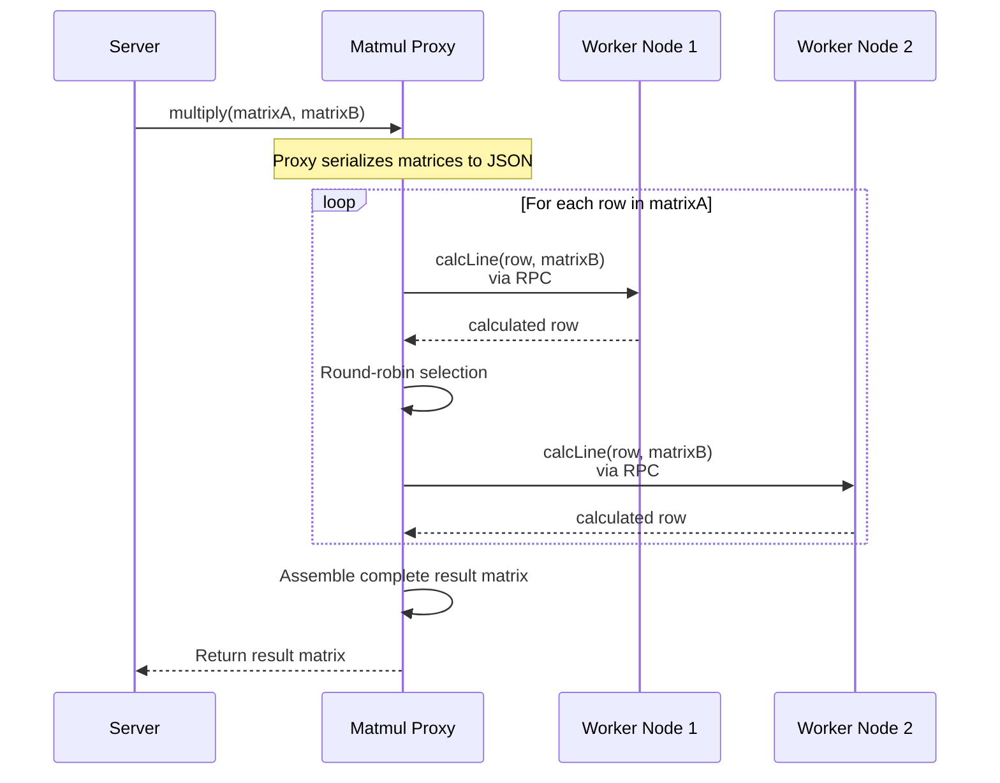
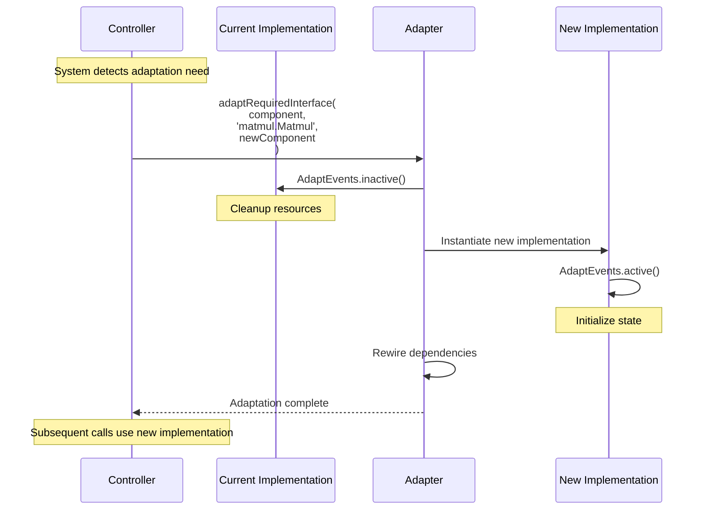
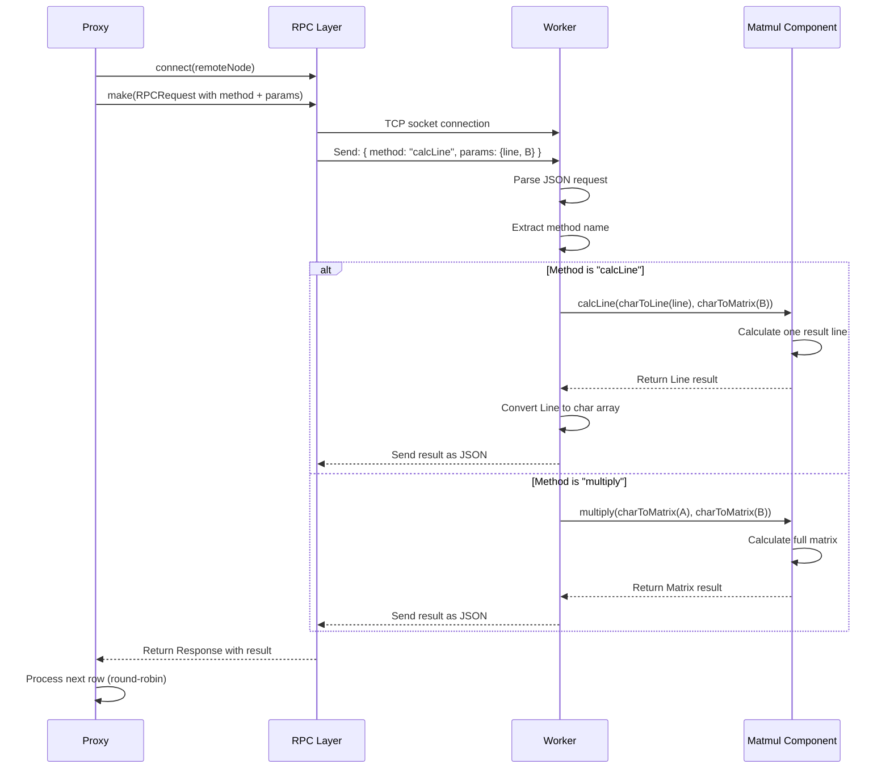

# System Flow Diagrams

This document contains detailed Mermaid diagrams explaining the distributed matrix multiplication system flow, focusing on request processing and proxy adaptation mechanisms.

## Overview

The system performs distributed matrix multiplication with runtime adaptation capabilities. It can dynamically switch between local computation and distributed computation across multiple worker nodes based on performance metrics or explicit configuration.

**Key Capabilities:**
- Receive matrix multiplication requests via HTTP POST
- Switch between local and distributed computation at runtime
- Distribute workload to multiple remote worker nodes
- Monitor response time and adapt automatically

## Diagram Navigation

- **Diagram 1**: High-level system architecture
- **Diagram 2**: Complete request processing flow
- **Diagram 3**: Proxy adaptation decision process
- **Diagram 4**: Distributed computation flow with proxy
- **Diagram 5**: Runtime adaptation mechanism details
- **Diagram 6**: Remote worker node processing

---

## 1. System Architecture Overview

This diagram shows the high-level components and their relationships.



## 2. Request Processing Flow

This diagram shows how a matrix multiplication request flows through the system.



## 3. Proxy Adaptation Process

This diagram shows how the system switches between local computation and distributed computation via the proxy.



## 4. Distributed Computation Flow

This diagram shows how the proxy distributes matrix calculations to remote worker nodes.



## 5. Runtime Adaptation Mechanism

This diagram details how the system performs runtime adaptation between implementations.



## 6. Remote Worker Processing

This diagram shows how remote worker nodes process calculation requests from the proxy.



## Key Components Explained

### Server Component (`server/Server.dn`)
- Binds to TCP port 8080 and accepts HTTP connections
- Loads components dynamically: `Matmul.o` (local) and `Matmul.proxy.o` (distributed)
- Uses `composition.RecursiveLoader` to load components and wire dependencies
- Performs runtime adaptation using `composition.Adapt.adaptRequiredInterface()`
- Provides three initialization modes:
  - **Mode 1 (proxy)**: Start with distributed computation
  - **Mode 2 (adapt)**: Start local, switch to proxy if response time > 200ms
  - **Mode 3 (serial)**: Always use local computation

### MatmulController (`server/MatmulController.dn`)
- Extracts matrices from JSON request body (`MultiplyParamsFormat`)
- Calls `matmul.multiply()` on the current matmul implementation
- Converts result matrix back to JSON string for HTTP response
- Returns HTTP 200 with result or 404 for invalid requests

### Matmul Implementation - Local (`matmul/Matmul.dn`)
- Performs matrix multiplication locally (serial computation)
- Calculates each result line by iterating through rows of matrix A
- Uses `calcLine()` method to compute one row of the result matrix
- Includes conversion utilities: `matrixToChar`, `charToMatrix`, `lineToChar`, `charToLine`

### Matmul Proxy (`matmul/Matmul.proxy.dn`)
- Implements the same `Matmul` interface but delegates to remote workers
- Distributes `calcLine` operations to worker nodes via RPC
- Uses round-robin load balancing between available worker nodes
- Serializes matrices to JSON for network transmission
- Implements `AdaptEvents` interface for runtime adaptation callbacks
- Receives `active()` and `inactive()` lifecycle notifications

### Remote Worker Nodes (`server/Remote.matmul.dn`)
- Receives calculation requests via TCP socket connections
- Parses RPC requests containing method name and JSON parameters
- Routes to appropriate matmul method based on request:
  - `calcLine`: Calculates one line of result matrix
  - `multiply`: Calculates full matrix (alternative mode)
- Returns results as JSON-encoded responses
- Can run on multiple ports (8081, 8082, etc.) for horizontal scaling

## Proxy Adaptation Mechanism

### How Proxy is Changed

The system can switch between local and distributed computation at runtime without restarting:

1. **Initial Wiring**: Components are loaded and wired using `wire()` method
   ```dana
   matmulController.wire("matmul.Matmul", matmulProxy.mainComponent, "matmul.Matmul")
   ```

2. **Runtime Adaptation**: Uses Dana's `composition.Adapt` API
   ```dana
   adapter.adaptRequiredInterface(
       matmulController,      // component to adapt
       "matmul.Matmul",       // interface name to rewire
       matmulProxy            // new implementation
   )
   ```

3. **State Transfer**: The proxy implements `AdaptEvents` interface
   - `AdaptEvents:active()`: Called when proxy is activated
   - `AdaptEvents:inactive()`: Called when proxy is deactivated

4. **Transparent Switch**: All subsequent calls to `matmul.multiply()` go through the new implementation

